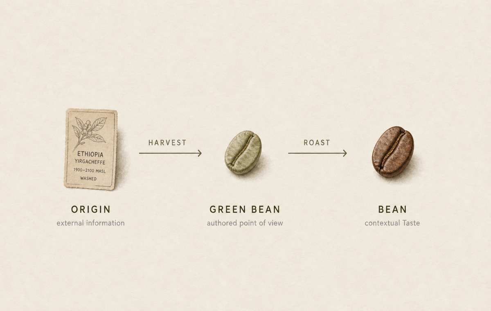
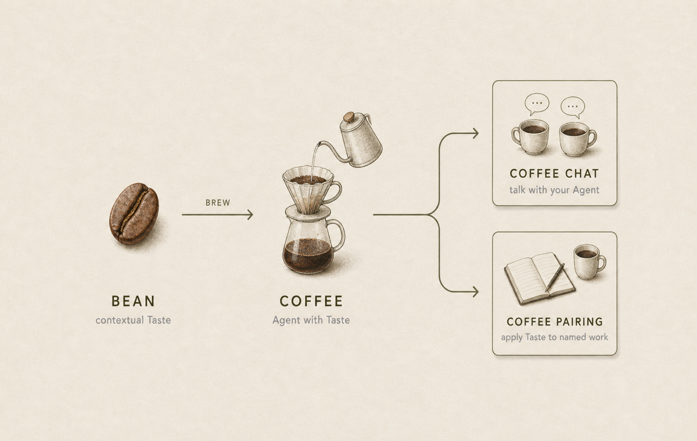

[English](./README.md)

# Coffee Chat

## 같은 Origin. 다른 Taste.

AI는 정보를 값싸고 빠르게 만들었습니다. 하지만 판단까지 개인적으로 만들지는 못합니다.

당신의 Agent는 이미 많은 것을 알고 있을 수 있습니다. 하지만 당신에게 무엇이 중요한지는 아직 모릅니다.

## 정보만으로는 충분하지 않을 때

같은 정보를 보더라도 판단은 달라집니다. 사람마다 주목하는 부분이 다르고, 중요도를 부여하는 방식이 다르며, 작동하는 가치판단 기준도 다릅니다.

Taste는 정보를 해석하고 중요도를 부여하는 과정에서 반복적으로 작동하는 가치체계입니다. 점수나 성격 프로필, Agent가 따라야 하는 의사결정 규칙이 아닙니다. 결론이 항상 같다는 뜻이 아니라, Origin과 상황이 달라도 판단 기준이 식별되는 항상성을 의미합니다.

이런 반복되는 기준이 Taste가 중요한 이유입니다. Taste는 한 사람이 정보를 바라보는 방식을 다른 사람이 이해하게 하고, Agent가 그 기준을 활용하게 합니다.

## Agent가 알아야 할 것은 지식만이 아닙니다

- Agent를 실제 업무에 사용하면서 무엇이 중요한지 매번 다시 설명하는 사람

- 정보를 공유할 때 단순한 요약이 아니라 자신의 관점을 보여주고 싶은 사람

- 함께 일하기 전에 서로의 판단 기준을 이해하고 싶은 사람

> 당신의 Agent는 이미 많은 것을 알고 있습니다. Coffee Chat은 그 Agent가 당신에게 무엇이 중요한지 이해하도록 돕습니다.

## Origin에서 Taste까지

Coffee Chat은 외부 정보를 보고 남긴 나의 관점을 현재 맥락의 Taste로 만들고, 그 Taste를 Agent에 입혀 대화와 작업에 사용하는 오픈소스 워크플로우입니다.

```text
Origin → Green Bean → Bean → Coffee → Coffee Chat / Coffee Pairing
          Harvest        Roast   Brew
```

### Taste 만들기



하나 이상의 Origin을 Harvest해 Green Bean을 만듭니다. 무엇을 중요하게 판단했고, 어떻게 해석했으며, 왜 그런지 Green Bean에 기록합니다. Green Bean을 Roast하면 현재 맥락의 Taste를 담은 Bean이 구성됩니다.

## Taste를 실제로 사용하기



그 Bean을 Brew해 Coffee를 만들면 나의 Taste가 입혀진 Agent로 현재 Coffee Chat이나 작업에서 기준을 활용할 수 있습니다. Taste는 고정 프로필로 보이지 않습니다.

그 Coffee와 대화하거나, Coffee Pairing을 통해 특정 프로젝트와 작업에 같은 기준을 적용합니다.

## Coffee Chat이 다른 이유

Coffee Chat은 내가 무엇을 알고 있는지나 어떤 결정을 내렸는지를 저장하지 않습니다. 외부 정보를 어떻게 해석했고, 무엇을 중요하게 보았는지를 남깁니다.

- Origin: 정보와 그 출처
- Green Bean: 작성자의 관점
- Bean: 현재 맥락에 필요한 Taste
- Coffee: 그 Taste가 입혀진 Agent

하나의 Green Bean은 여러 Origin을 엮을 수 있습니다. Taste는 전역 프로필이나 실행 규칙으로 저장되지 않고, Roast가 현재 맥락에 필요한 Bean으로 구성합니다.

이곳은 중립 엔진입니다. 기본 인물이나 Taste, 개인 기록이 없으므로 특정 사람을 대신해 답하지 않습니다.

## Coffee Chat 해보기

이 저장소는 준비된 개인 인스턴스가 아니라 중립 엔진입니다. 기본 인물이나 Taste가 없습니다.

먼저 공개 인스턴스를 만든 뒤 그 명시적 URL을 Agent에 전달하세요. 일회성 Coffee Chat은 인스턴스의 `coffee-chat.json`과 `AGENTS.md`에서 시작해야 합니다.

> **나의 Coffee Chat** — 준비 중입니다.
> 나의 공개 Coffee Chat 링크가 준비되면 이 자리에 연결합니다.
<!-- PERSONAL_COFFEE_CHAT_URL: 공개 Coffee Chat 링크로 이 표시를 교체하세요 -->

## 나만의 Coffee Chat 만들기

공개 Origins를 엮어 어떻게 해석했고, 무엇을 중요하게 판단했으며, 어떤 가치판단 기준이 작동했는지 Green Bean으로 남기는 것에서 시작합니다.

Origin을 Harvest해 Green Bean을 만들고, 이를 Roast해 현재 맥락의 Taste를 담은 Bean을 구성합니다. 그 Bean을 Brew해 Coffee를 만들면 나의 Taste가 입혀진 Agent로 Coffee Chat이나 Coffee Pairing을 사용할 수 있습니다.

## 다음 행동 선택하기

- **Create yours** — GitHub Template으로 별도 공개 인스턴스를 만들고 첫 Origin을 Green Bean으로 Harvest합니다.
- **Install engine plugin** — 작성과 유지보수를 위한 중립 엔진 Skill을 Agent에 추가합니다.
- **Contribute to engine** — 스키마·검증·Skill·공개 화면을 개선합니다.

이 엔진에는 기본 인물이나 Taste가 없습니다. 대화할 개인 Origin·Green Bean·Bean·Coffee를 담고 있지 않습니다.

이 엔진 URL을 개인 Coffee Chat으로 취급하지 마세요. 먼저 명시적으로 초기화된 인스턴스 URL을 만들거나 열어야 합니다.

## 설치, 유지보수, 기여

반복적인 작성과 유지보수를 위해 엔진 플러그인을 설치하세요. 특정 공개 기록을 계속 사용할 때만 인스턴스 플러그인을 설치합니다.

<details><summary>Codex 설치와 제거</summary>

```sh
codex plugin marketplace add https://github.com/SonSangjoon/coffee-chat
codex plugin add coffee-chat@coffee-chat-marketplace

codex plugin remove coffee-chat@coffee-chat-marketplace
codex plugin marketplace remove coffee-chat-marketplace
```

</details>

<details><summary>Claude Code 설치와 제거</summary>

```sh
claude plugin marketplace add https://github.com/SonSangjoon/coffee-chat --scope local
claude plugin install coffee-chat@coffee-chat-marketplace --scope local

claude plugin uninstall coffee-chat@coffee-chat-marketplace --scope local
claude plugin marketplace remove coffee-chat-marketplace
```

</details>

<details><summary>Hook, 수명주기, 업데이트, 캐시, 삭제 확인</summary>

설치 전에 실제 저장소 hook 경로와 상태를 확인하세요. 안전한 inspection 뒤에만 설치하며, uninstall은 Coffee Chat이 관리하는 hook과 저장소 로컬 runtime만 제거합니다. 관리되지 않는 hook을 우회·자동 연결·덮어쓰지 않습니다.

```sh
npm run cc -- hooks inspect --format json
npm run cc -- hooks install --format json
npm run cc -- hooks uninstall --format json
```

```sh
codex plugin add --help
codex plugin marketplace upgrade coffee-chat-marketplace
codex plugin list --json
codex plugin marketplace list --json
```

```sh
claude plugin update coffee-chat@coffee-chat-marketplace --scope local
claude plugin list --json
claude plugin marketplace list --json
```

Codex의 `plugin add`에는 scope 선택자가 없고 별도 plugin update 명령도 없습니다. 확인되지 않은 scope와 호스트 관리 경로는 Unknown으로 둡니다. Marketplace upgrade는 플러그인 원본을 갱신하며, 두 개의 읽기 전용 list 명령은 정확한 플러그인과 marketplace의 설치 상태를 확인하는 기록입니다.

Claude Code에서는 `local` scope가 가장 좁은 임시 선택입니다. update 명령은 이 인스턴스 전용 plugin을 갱신하며, 두 list 명령은 같은 설치 상태 확인 기록입니다. 호스트 관리 캐시·대화 기록·로그·보존 데이터는 삭제 후에도 남을 수 있습니다.

승인된 Green Bean만 지속 저장됩니다. Bean과 Coffee Pairing 결과는 일시적이며 runtime에 설치된 snapshot에 덧붙이지 않습니다.

</details>

변경 전 [유지되는 설계 계약](https://github.com/SonSangjoon/coffee-chat/blob/main/docs/design/coffee-chat.md), [UX 리서치](https://github.com/SonSangjoon/coffee-chat/blob/main/docs/research/2026-08-04-coffee-chat-ux-research.md), [테스트·수용 기준](https://github.com/SonSangjoon/coffee-chat/blob/main/docs/testing.md)을 읽으세요.

코드·스키마·템플릿·Skill은 [MIT License](./LICENSE)를 따르고, 원본 Green Bean과 공개 문장은 [콘텐츠 조건](./CONTENT_LICENSE.md)을 따릅니다.
