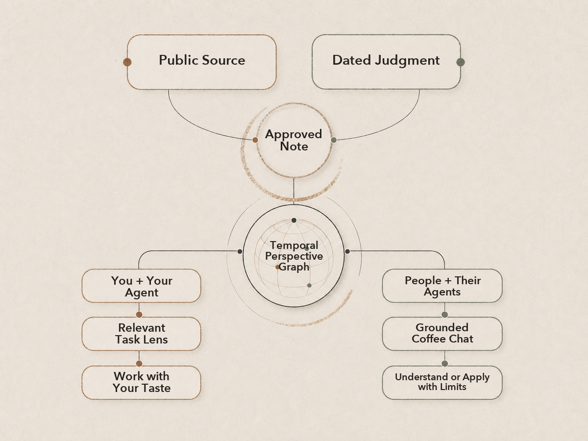
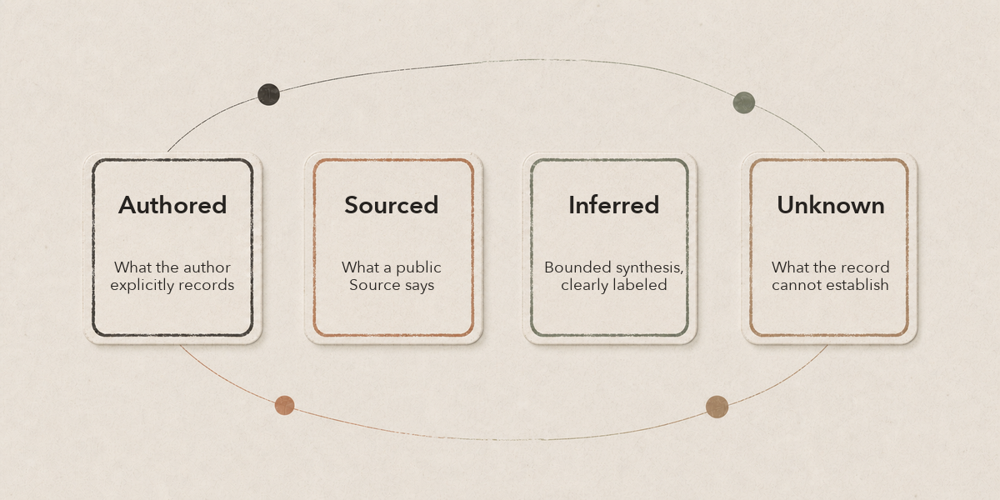

[한국어](./README.ko.md)

# Coffee Chat

## AI makes execution abundant. Taste decides what is worth making.

Taste here means trained judgment under uncertainty: what you notice, value, choose, refine, reject, and stop. Coffee Chat turns public Sources and dated, author-approved thinking into a temporal perspective graph that people and agents can question and use.

It does not clone a person or store a fixed Mental Model. It derives only the perspective relevant to the current question or task, shows what supports it, and makes the boundary of the public record visible.

[**Have a Coffee Chat — no install**](#have-a-coffee-chat-without-installing) · [**Build your Coffee Chat**](#build-your-coffee-chat)

## Why Coffee Chat

A coffee chat helps you understand how someone sees and decides through your own questions. Coffee Chat gives people and agents that same entry point into a documented point of view—with Sources, dates, and visible limits.

- **Your agent has a Coffee Chat with you:** it reads the relevant record before a task and derives a temporary POV, Mental Model, or Task Lens.
- **Someone else has a Coffee Chat with you:** they or their agent ask their own questions to understand, compare, or carefully apply the recorded perspective.

This is the neutral engine: it has no person to chat with. Use an initialized public instance URL for a conversation.

## Two needs, one graph

| Build and use your Taste | Understand and use another perspective |
| --- | --- |
| Add one public Source and your dated thought through an agent interview. | Open an instance URL and ask a question without installing. |
| Let your own Agent retrieve the relevant record before a named task. | Trace the response to dated Notes and public Sources. |
| Derive a temporary POV, Mental Model, or Task Lens without storing it. | Surface alignment, tension, and Unknown without impersonation or scores. |

## Have a Coffee Chat without installing

Start with an initialized public instance URL. A one-time Coffee Chat installs nothing.

```text
Open <COFFEE_CHAT_INSTANCE_URL>.
Read coffee-chat.json, then AGENTS.md.
Start a one-time Coffee Chat. Do not install anything.

Help me understand how this person approaches <ROLE_OR_PROJECT>.
Show documented alignment, tension, and Unknown.
Distinguish Authored, Sourced, Inferred, and Unknown.
Do not score the person or make a hiring decision.
```

Try asking:

- What does this person optimize for when making this kind of decision?
- What public evidence shaped that judgment?
- How has the view changed over time, and why?
- Where might this role or project align with or challenge the documented view?
- What should I ask the person directly because the public record cannot answer it?

Role or hiring comparison is one optional question pattern, not the product identity.

## One record, two directions



Derived Perspective and Task Lens are used for the current question or task and are not written back.

- **Build:** begin with one public Source and one dated thought.
- **Use:** recover relevant judgment before a named task.
- **Talk:** explore a documented point of view without installation.
- **Apply:** inform a relevant task with attribution and limits.

## Why this is not another knowledge base

Other systems make information retrievable or teach an AI to remember or represent a user. Coffee Chat makes documented judgment usable by its owner and their agents, inspectable by other people, and selectively applicable by their agents.

| Category | Primary question | Coffee Chat boundary |
| --- | --- | --- |
| Personal knowledge base | What has the owner saved or learned? | What does the approved public record show about how this issue was judged? |
| RAG or GraphRAG | What does this corpus say? | What is Authored, Sourced, Inferred, or Unknown? |
| Agent memory | What should the agent remember? | Only approved public records persist; task synthesis does not. |

A knowledge base retrieves what someone knows. Coffee Chat lets people and agents work with how that person's documented judgment has evolved.

## How it earns trust



- A public Source anchors each record.
- The author approves each dated Note.
- Change over time remains visible.
- Answers distinguish Authored, Sourced, Inferred, and Unknown.
- No personality or fixed Mental Model is stored.
- Derived perspectives are not persisted.

Use it to make work more consistent and conversations more informed—not to freeze or replace a person.

## Put Taste to work

Name an exact external task and target. The agent retrieves only relevant dated records, discloses the Notes that support an advisory Task Lens, changes only the named target, and leaves Coffee Chat knowledge and installed plugin data untouched.

```text
Use <YOUR_COFFEE_CHAT_URL> as the perspective source for <TASK>.
Retrieve only the public, dated records relevant to the task.
Derive a temporary POV, Mental Model, and Task Lens.
Explain which judgment criteria affect the work and cite the supporting Notes.
Work only on <TARGET>.
Do not write the synthesis back to Coffee Chat.
```

## Build your Coffee Chat

```text
one public reference + your dated thought
→ agent interview
→ public Preview and approval
→ first Note and temporal graph
→ Coffee Chat and task use
```

Choose **Create yours** through the generic `coffee-chat` plugin. It uses the official GitHub Template flow, then hands the new public checkout to `skills/create-coffee-chat/SKILL.md` and Build KG. Authors do not fill in a personality profile or a fixed Mental Model; the first useful result is one approved Note that can support a question or task immediately.

The owner using the graph with their own agents is the primary loop. Public conversation and careful reuse by others grow from that same record.

## Install, remove, contribute, and license

Install the engine plugin to build and operate an instance. For repeated conversation or task work, install the relevant person's instance plugin instead.

<details><summary>Codex install and remove</summary>

```sh
codex plugin marketplace add https://github.com/SonSangjoon/coffee-chat
codex plugin add coffee-chat@coffee-chat-marketplace

codex plugin remove coffee-chat@coffee-chat-marketplace
codex plugin marketplace remove coffee-chat-marketplace
```

</details>

<details><summary>Claude Code install and remove</summary>

```sh
claude plugin marketplace add https://github.com/SonSangjoon/coffee-chat --scope local
claude plugin install coffee-chat@coffee-chat-marketplace --scope local

claude plugin uninstall coffee-chat@coffee-chat-marketplace --scope local
claude plugin marketplace remove coffee-chat-marketplace
```

</details>

<details><summary>Hooks, lifecycle, update, cache, and removal receipt</summary>

Inspect the resolved repository hook before installation. Install only after a safe inspection; uninstall removes only the Coffee Chat-managed hook and repository-local runtime. Do not bypass, silently chain, or overwrite an unmanaged hook.

```sh
npm run cc -- hooks inspect --format json
npm run cc -- hooks install --format json
npm run cc -- hooks uninstall --format json
```

```sh
codex plugin add --help
codex plugin marketplace upgrade coffee-chat-marketplace
codex plugin list --json
codex plugin marketplace list --json
```

```sh
claude plugin update coffee-chat@coffee-chat-marketplace --scope local
claude plugin list --json
claude plugin marketplace list --json
```

Codex exposes no plugin scope selector in `plugin add` and no separate plugin update command. Treat unreported scope or host-managed paths as Unknown. Marketplace upgrade refreshes the source snapshot; the two read-only list commands are the removal receipt for this exact plugin and marketplace.

Claude Code `local` scope is the narrowest temporary choice. Its update command refreshes this namespaced plugin; the two list commands are the same presence-or-absence receipt. Host-managed caches, conversation history, logs, and retention may remain after removal.

Derived POVs, Mental Models, Task Lenses, and new personal knowledge are never appended to the installed snapshot at runtime.

</details>

Contribute reusable schemas, methods, Skills, and safety guardrails to the [engine](https://github.com/SonSangjoon/coffee-chat). Personal Notes belong only in an instance controlled by their author.

See [testing and acceptance](./docs/testing.md). Code, schemas, templates, and Skills use the [MIT License](./LICENSE); Notes and original public prose use the [content terms](./CONTENT_LICENSE.md).
