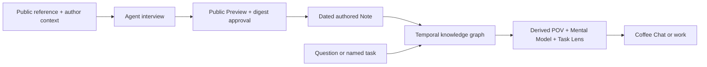

# Coffee Chat

> **Talk with a point of view, not a personality prompt.**
>
> **성격 프롬프트가 아니라, 근거가 있는 관점과 대화하세요.**

Coffee Chat is a temporal, source-linked personal knowledge graph for conversation and agent work. It lets you explore a person's recorded point of view, trace it to public Sources and dates, and see how it changed over time. Every answer keeps the author's record separate from source material, agent inference, and what remains unknown.
Coffee Chat은 대화와 에이전트 업무를 위한 출처 기반 시계열 개인 지식 그래프입니다. 한 사람의 기록된 관점을 탐색하고, 공개 Source와 날짜까지 근거를 따라가며, 시간에 따른 변화를 살펴볼 수 있습니다. 모든 답변은 작성자의 기록·출처 내용·에이전트 추론·알 수 없는 부분을 구분합니다.

Use it once by URL, or install that person's Coffee Chat plugin in Codex or Claude Code so an agent can derive the relevant POV, Mental Model, and Task Lens for real work.
URL로 한 번 대화하거나, 그 사람의 Coffee Chat 플러그인을 Codex 또는 Claude Code에 설치하세요. 에이전트가 실제 업무에 필요한 POV·Mental Model·Task Lens를 그때그때 도출해 적용합니다.

Coffee Chat starts from a premise: as AI lowers the cost of execution, point of view and mental models become the layer that shapes what an agent notices, values, and does. This project makes that layer usable in conversation and work without freezing it into a permanent persona file.
Coffee Chat은 한 가지 전제에서 출발합니다. AI가 실행 비용을 낮출수록 에이전트가 무엇을 보고, 중요하게 여기고, 어떻게 행동할지를 결정하는 관점과 멘탈 모델이 더 중요해집니다. 이 프로젝트는 이를 영구적인 persona 파일로 고정하지 않고 대화와 업무에 활용하게 합니다.

> [!IMPORTANT]
> Coffee Chat does not crawl external publishing platforms and turn them into a profile. The author builds the knowledge graph here through an agent interview, a public-content Preview, and explicit approval. POV and Mental Model are then derived from that graph for each conversation or task.
>
> Coffee Chat은 외부 게시 플랫폼을 크롤링해 프로필로 만드는 도구가 아닙니다. 작성자는 에이전트 인터뷰·공개 내용 Preview·명시적 승인을 거쳐 여기에서 지식 그래프를 구축합니다. POV와 Mental Model은 대화나 작업마다 이 그래프에서 도출됩니다.

## Talk with a Coffee Chat / Coffee Chat과 대화하기

Someone shared their Coffee Chat URL? Give the instance URL to Codex, Claude, or another web-capable agent. A one-time Coffee Chat installs nothing.
누군가 Coffee Chat URL을 공유했다면 그 인스턴스 URL을 Codex·Claude 또는 웹을 볼 수 있는 에이전트에 전달하세요. 일회성 Coffee Chat은 아무것도 설치하지 않습니다.

This repository is the generic engine and represents no person. A conversation starts from an author's instance, for example `https://github.com/OWNER/coffee-chat-instance`.
이 저장소는 특정 인물을 담지 않은 범용 엔진입니다. 대화는 `https://github.com/OWNER/coffee-chat-instance`와 같은 작성자의 인스턴스에서 시작합니다.

```text
Open <COFFEE_CHAT_INSTANCE_URL>.
Read `coffee-chat.json`, then `AGENTS.md`.
Start a one-time Coffee Chat. Do not install anything.
Use the dated public knowledge graph and:
- distinguish Authored, Sourced, Inferred, and Unknown
- show the relevant Sources and dates
- classify changed views as evolution, contextual coexistence, tension, contradiction, or Unknown only when the records support it.
```

Try asking / 이렇게 물어보세요:

- What is this author's POV on a topic, and what shaped it? / 이 주제에 대한 작성자의 POV는 무엇이며, 무엇이 그 관점을 만들었나요?
- How has that view changed over time? / 그 관점은 시간에 따라 어떻게 달라졌나요?
- Where is the evidence limited or the view context-dependent? / 근거가 부족하거나 맥락에 따라 달라지는 부분은 어디인가요?
- Apply this perspective to my decision without putting words in the author's mouth. / 작성자가 말하지 않은 내용을 만들어내지 말고, 이 관점을 내 의사결정에 적용해 주세요.

Fictional answer shape / 가상 답변 형태:

> **Question** — How has this author's recorded POV on `<topic>` changed?
>
> **Authored · earlier date** — What an earlier dated Note explicitly records.
>
> **Authored · later date** — What a later dated Note explicitly records.
>
> **Sourced** — What the linked public Sources contribute.
>
> **Inferred** — A bounded interpretation of the change, clearly labeled.
>
> **Unknown** — What the public record cannot establish.

## Put a point of view to work / 관점을 업무에 적용하기

A Coffee Chat is also a task-scoped perspective layer for Codex and Claude Code. The agent retrieves only the relevant temporal subgraph, derives a temporary POV, Mental Model, or Task Lens, and applies it to the named task without writing that synthesis back.
Coffee Chat은 Codex와 Claude Code를 위한 작업별 관점 레이어이기도 합니다. 에이전트는 관련 시계열 부분 그래프만 검색해 임시 POV·Mental Model·Task Lens를 도출하고, 그 합성을 다시 저장하지 않은 채 명시된 작업에 적용합니다.

For repeated perspective work, install the author's instance plugin, not this engine plugin. The instance README supplies commands with that author's plugin and marketplace names.
관점을 반복해서 업무에 쓰려면 이 엔진 플러그인이 아니라 작성자의 인스턴스 플러그인을 설치하세요. 해당 인스턴스 README가 작성자별 플러그인·marketplace 이름이 들어간 명령을 제공합니다.

```text
Use <COFFEE_CHAT_INSTANCE_URL> as the perspective source for <TASK>.
Retrieve only the public, dated knowledge relevant to the task.
Derive a temporary POV, Mental Model, and Task Lens.
Explain which criteria this changes and distinguish Authored from Inferred.
Work only on <TARGET> and do not write the synthesis back to Coffee Chat.
```

## How a POV is made / POV가 만들어지는 과정



Public references and dated authored Notes are the record. The graph links them across Sources, neutral Entities, and time. POV, Mental Model, and Task Lens are derived only for the current question or task and are not written back.
공개 레퍼런스와 날짜가 있는 작성자 Note가 기록의 원본입니다. 그래프는 이를 Source·중립 Entity·시간으로 연결합니다. POV·Mental Model·Task Lens는 현재 질문이나 작업에 맞춰서만 도출되며 다시 저장되지 않습니다.

Your POV is not a profile field you fill in once. It emerges from the evidence relevant to the question and the time being discussed.
POV는 한 번 작성해 고정하는 프로필 항목이 아닙니다. 질문과 시점에 관련된 근거에서 그때마다 발현됩니다.

## Why trust it / 신뢰할 수 있는 이유

- **Source-backed / 출처 기반:** every canonical Note starts from a public URL and keeps its citation metadata. / 모든 정식 Note는 공개 URL에서 시작하며 인용 메타데이터를 보존합니다.
- **Time-aware / 시계열:** changed views remain visible with dates and evidence, then are classified as evolution, contextual coexistence, tension, contradiction, or `Unknown` only when supported. / 달라진 관점을 날짜·근거와 함께 보존하고, 근거가 있을 때만 변화·맥락적 공존·긴장·모순·`Unknown`으로 구분합니다.
- **Attribution-aware / 구분 가능한 해석:** answers separate `Authored`, `Sourced`, `Inferred`, and `Unknown`. / 답변은 작성자 생각·출처 내용·에이전트 추론·알 수 없음을 구분합니다.
- **No personality prompt / 성격 프롬프트 없음:** the record does not ask authors to declare their personality, strengths, or weaknesses. / 작성자에게 성격·장점·단점을 스스로 규정해 저장하도록 요구하지 않습니다.
- **Ephemeral synthesis / 비영속 합성:** fixed POVs and Mental Models are never stored in Git, Pages, or plugin caches. / 고정된 POV와 Mental Model은 Git·Pages·플러그인 캐시에 저장하지 않습니다.
- **Read-only by default / 기본은 읽기 전용:** one-time Coffee Chat changes neither the repository nor host configuration. / 일회성 Coffee Chat은 저장소나 호스트 설정을 변경하지 않습니다.

Coffee Chat is an AI synthesis of public evidence. It is not the person and must not invent unrecorded beliefs.
Coffee Chat은 공개 근거를 바탕으로 한 AI 합성입니다. 본인이 아니며 기록되지 않은 생각을 만들어내서는 안 됩니다.

## Create your Coffee Chat / 나의 Coffee Chat 만들기

A Coffee Chat starts with one public reference and your dated thought about it. Over time, it becomes a public knowledge window that lets people converse with your recorded POV and lets your agents use the relevant perspective in personal work.
Coffee Chat은 공개 레퍼런스 하나와 그에 대한 날짜가 있는 생각에서 시작합니다. 이것이 쌓이면 다른 사람이 기록된 POV와 대화하고, 나의 에이전트가 개인 업무에 관련 관점을 활용할 수 있는 공개 지식 창구가 됩니다.

1. Fork this knowledge-free engine into a separate instance repository. / 이 지식 비포함 엔진을 별도의 개인 인스턴스 저장소로 포크합니다.
2. Give the agent one public reference and talk through your interpretation, counterpoint, context, or experience. / 공개 레퍼런스 하나를 주고 해석·반론·맥락·경험을 에이전트와 대화합니다.
3. Review the complete public-content Preview and exact Candidate digest. / 공개될 전체 Preview와 정확한 Candidate digest를 확인합니다.
4. Approve only when it says what you mean; the agent then writes the Note, Entities, graph, plugin, and Pages projections. / 의도한 내용이 맞을 때만 승인하면 에이전트가 Note·Entity·그래프·플러그인·Pages projection을 작성합니다.
5. Repeat naturally. There is no score, required Source count, or rule that decides whether your perspective is correct. / 자연스럽게 반복합니다. 관점의 정답을 판단하는 점수·필수 Source 개수·의미 규칙은 없습니다.

Give this repository to your agent / 이 저장소를 에이전트에 전달하세요:

```text
Open https://github.com/SonSangjoon/coffee-chat.
Read `coffee-chat.json`, then `AGENTS.md`.
Help me create a separate Coffee Chat instance.
Start with one public reference and interview me to capture my dated thought.
Show the complete public-content Preview and Candidate digest before mutating canonical instance files.
```

| Stored as the knowledge record / 지식 원본으로 저장 | Derived when needed / 필요할 때 도출 |
| --- | --- |
| Public Source URLs and citation observations / 공개 Source URL과 인용 관찰값 | Query-scoped POV / 질문별 POV |
| Dated authored Notes / 날짜가 있는 작성자 Note | Mental Model / Mental Model |
| Neutral Entity identity and temporal links / 중립 Entity identity와 시계열 연결 | Task Lens / Task Lens |

## Use once or install / 일회성 사용 또는 설치

The URL-based one-time path is the default. For repeated work with a particular recorded POV, follow that instance's README to install its public KG snapshot into Codex or Claude Code. The commands below install only the knowledge-free engine plugin for creating and operating Coffee Chats; it contains no represented-person Profile or Notes payload.
URL 기반 일회성 사용이 기본입니다. 특정 기록된 POV를 반복적으로 업무에 활용하려면 해당 인스턴스 README에 따라 공개 KG snapshot을 Codex 또는 Claude Code에 설치하세요. 아래 명령은 Coffee Chat을 만들고 운영하는 지식 비포함 엔진 플러그인만 설치하며, 특정 인물의 Profile이나 Note payload는 포함하지 않습니다.

<details>
<summary>Codex install and remove / Codex 설치와 삭제</summary>

```sh
codex plugin marketplace add https://github.com/SonSangjoon/coffee-chat
codex plugin add coffee-chat@coffee-chat-marketplace
```

```sh
codex plugin remove coffee-chat@coffee-chat-marketplace
codex plugin marketplace remove coffee-chat-marketplace
```

</details>

<details>
<summary>Claude Code local-scope install and remove / Claude Code local scope 설치와 삭제</summary>

```sh
claude plugin marketplace add https://github.com/SonSangjoon/coffee-chat --scope local
claude plugin install coffee-chat@coffee-chat-marketplace --scope local
```

```sh
claude plugin uninstall coffee-chat@coffee-chat-marketplace --scope local
claude plugin marketplace remove coffee-chat-marketplace
```

</details>

## Contribute to the engine / 엔진에 기여하기

Contribute reusable schemas, methods, Skills, and safety guardrails here. Personal Notes belong only in an instance controlled by their author.
이곳에는 재사용 가능한 스키마·방법론·Skill·안전 guardrail을 기여합니다. 개인 Note는 작성자가 관리하는 인스턴스에만 둡니다.

See [testing and acceptance](./docs/testing.md) for the local verification matrix.
로컬 검증 항목은 [testing and acceptance](./docs/testing.md)에서 확인할 수 있습니다.

Code, schemas, templates, and Skills use the [MIT License](./LICENSE). Downstream authors own their Notes; see the [content terms](./CONTENT_LICENSE.md).
