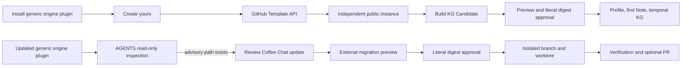

# Coffee Chat Agent Lifecycle Design

**Status:** Approved

**Date:** 2026-08-03

**Scope:** Template-based instance creation, durable engine provenance, Skill-driven engine updates, and instance attribution

This specification extends the approved Coffee Chat v1 design. It supersedes only the earlier assumptions that creation is a manual template action, the plugin contains exactly three Skills in every role, and template-to-instance engine updates are outside v1. The knowledge model, public-source boundary, temporal semantics, Candidate approval model, non-persistence of Derived Perspective and Task Lens, and security guardrails remain unchanged.

## 1. Product decision

Coffee Chat has two independently useful products:

1. a neutral engine that lets anyone create a public, source-grounded temporal perspective graph; and
2. a personal instance that people and agents can question or apply to a named task.

The engine remains knowledge-free. A personal instance is an independent public GitHub repository created from the engine through GitHub's native Template mechanism. The generic engine plugin makes creation and later structural updates agent-driven, but it never turns an instance into a centrally managed clone.

There is no local-only instance-creation, local-merge, or private-lifecycle route in v1. Temporary local checkouts and isolated worktrees are implementation substrates for verification before the remote GitHub publication; they are not alternate distribution modes.

The lifecycle is:



There is no central Showcase, registry, usage counter, hidden telemetry, background service, or automatic mutation. Viral attribution comes from GitHub's native `template_repository` relation and a restrained `Built with Coffee Chat` link in each instance.

## 2. Repository and plugin roles

### 2.1 Maintained engine repository

The maintained repository has `repository_role: "engine"` and contains no Profile, Note, Entity, personal knowledge snapshot, or personal plugin namespace. It is the GitHub Template source and the canonical source for engine releases and migration definitions.

Its generic plugin is named `coffee-chat` and contains five Skills:

| Skill | Responsibility |
| --- | --- |
| `coffee-chat` | Read-only conversation with an explicit verified instance |
| `apply-perspective` | Apply a temporary Task Lens to an explicitly named external task |
| `build-kg` | The only writer of Profile, Note, Entity, and other canonical KG state |
| `create-coffee-chat` | Provision an independent repository with the GitHub Template API, verify native provenance, clone it, and hand off to its repo-local Build KG flow |
| `update-coffee-chat` | Inspect and migrate an existing instance from a verified engine release through Preview, approval, isolated application, and optional PR |

The generic plugin remains Skill-only. It does not package a custom executable, daemon, MCP server, runtime Hook, agent definition, or credential store.

Host refresh behavior is explicit: Codex refreshes the generic marketplace snapshot with `codex plugin marketplace upgrade coffee-chat-marketplace` and confirms the installed reference digests through its read-only plugin/marketplace listings plus isolated package inspection; it does not invent a `plugin update` command. Claude uses `claude plugin update coffee-chat@coffee-chat-marketplace --scope local` and confirms the same reference digests. A refresh is successful only when the installed package bytes, not merely a displayed version, match the intended release.

A changed generic plugin must not be distributed until `coffee-chat.json.plugin.version` has received one intentional bump and all marketplace metadata has been regenerated. Implementation commits may regenerate intermediate package bytes under the unreleased current version; Task 12 performs the single final `1.1.0` bump after all distributable inputs are fixed. The generated surface self-copy does not recursively demand another bump in that final projection transaction. A later Skill-only release may bump only the generic plugin version when both stable release inventories and their digest **and every migration registry/document byte** are unchanged. Any registry or migration-document change always requires a new engine version, immutable versioned source ref, regenerated release/registry/advisory bytes, and a generic-plugin release; a default-branch-only catalog edge is forbidden.

### 2.2 Personal instance repository

An instance has `repository_role: "instance"` and owns its Profile, public dated Notes, Entities, repository identity, content notice, and namespaced instance plugin.

`CONTENT_LICENSE.md` is canonical instance-authored state. Make mine creates it from the approved external request, later generation reads and passes through those exact bytes, and engine migration preserves them. It is not an engine-managed file or a generated-owned path.

Its generated personal plugin contains only:

- `coffee-chat`;
- `apply-perspective`;
- `build-kg`.

Creation and engine migration always come from a separately installed, verified generic `coffee-chat` engine plugin. An instance must not trust a stale repo-local updater as the source of a newer release.

## 3. Canonical identities

Four versions have different meanings and must never be substituted for one another:

| Field | Meaning |
| --- | --- |
| `coffee-chat.json.schema_version` | Root manifest contract |
| `knowledge/index.json.schema_version` | Knowledge-index and knowledge-digest contract |
| `coffee-chat.json.provenance.engine.version` | Adopted Coffee Chat engine release |
| `coffee-chat.json.plugin.version` | Personal or generic plugin package version |

The knowledge digest must use the knowledge-index schema version, not the root manifest schema version. Adding provenance or migrating engine structure must not change `knowledge_digest` when the knowledge semantics are unchanged.

### 3.1 Instance provenance

Every instance created under this contract stores:

```json
{
  "provenance": {
    "engine": {
      "repository": "https://github.com/SonSangjoon/coffee-chat",
      "version": "1.1.0",
      "source_commit": "0123456789abcdef0123456789abcdef01234567",
      "release_digest": "sha256:0123456789abcdef0123456789abcdef0123456789abcdef0123456789abcdef"
    },
    "created_from": {
      "method": "github-template",
      "template_repository": "https://github.com/SonSangjoon/coffee-chat"
    }
  }
}
```

Rules:

- `repository` and `template_repository` are canonical credential-free GitHub HTTPS repository URLs.
- `version` is strict SemVer.
- `source_commit` is exactly 40 or 64 lowercase hexadecimal characters and records the source revision observed during creation or update.
- `release_digest` is the verified engine-release digest described below.
- `created_from` is immutable. Engine updates replace only `provenance.engine`.
- The engine role forbids `provenance`.
- No `verified: true` flag is stored. Verification is an operation over current evidence, not a permanent fact.
- GitHub's public `template_repository` relation is the external creation evidence. The canonical fields above are the exact machine-readable engine adoption record; neither replaces the other.

### 3.2 Engine release manifest

The engine release identity has its own canonical source at `engine/release-config.json`:

```json
{
  "schema_version": "1.0.0",
  "version": "1.1.0",
  "source_ref": "refs/tags/v1.1.0",
  "target_manifest_schema_version": "1.1.0"
}
```

The engine repository URL remains canonical in the engine-role `coffee-chat.json`. The generated release combines that URL with this config. The generic plugin version remains canonical in `coffee-chat.json.plugin.version`. Neither version is derived from the other; both happen to begin at `1.1.0`, and a later engine-only Skill improvement may bump only the generic plugin version.

The engine owns a deterministic generated file at `engine/release.json`:

```ts
export type EngineReleaseManifest = {
  schema_version: "1.0.0";
  repository: string;
  version: string;
  source_ref: `refs/tags/v${string}`;
  target_manifest_schema_version: string;
  migration_registry: {
    path: "./engine/migrations/registry.json";
    digest: `sha256:${string}`;
  };
  managed_files: Array<{
    path: `./${string}`;
    class: "engine-source";
    digest: `sha256:${string}`;
    mode: "100644" | "100755";
  }>;
  delivery_files: Array<{
    path: `./${string}`;
    class: "engine-delivery";
    digest: `sha256:${string}`;
    mode: "100644" | "100755";
  }>;
  release_digest: `sha256:${string}`;
};
```

`release_digest` is SHA-256 over RFC 8785 canonical JSON of `{ domain: "coffee-chat-engine-release/v1", repository, version, source_ref, target_manifest_schema_version, managed_files, delivery_files }`. `managed_files` are adopted by an instance; `delivery_files` bind the engine-only verifier/update/migration/publication runtime and schemas that the generic Skill executes from a release checkout but Make mine deletes. The migration-registry object and `release_digest` are excluded from that digest. This separation is required because a migration edge names its target release digest; including the registry digest in the target release digest would be circular. The registry remains independently SHA-256-bound by `migration_registry.digest`, and the engine-update Candidate binds both digests plus every selected document digest. Registry and migration-document files remain outside both inventories.

`engine/release.json` excludes itself from `managed_files`, so the payload digest is not self-referential. The source commit is also excluded because a tracked file cannot safely name the commit that contains it; the versioned `source_ref` is resolved and the exact commit is observed during creation or update. Ref movement never bypasses verification because the resolved commit, release bytes, and every bound digest are rechecked before an applicable Candidate.

The managed inventory is closed and path-exact. It has no globs, duplicates, aliases, path escapes, or entries for:

- `coffee-chat.json`;
- `.coffee-chat/engine-lock.json`;
- `engine/release.json`;
- `engine/template-surface.json`;
- `engine/migrations/**`;
- `knowledge/**`;
- `CONTENT_LICENSE.md`;
- generated README, AGENTS, CLAUDE, index, plugin, marketplace, or Pages output.

Engine-source entries include the instance runtime, schemas, site source, the three instance-facing root Skills and shared method, instance-validating tests, package metadata, read-only PR CI, and shared static assets needed to reproduce an instance. Engine-delivery entries include the release verifier plus engine update/migration/publication runtime, their schemas, and every delivery-dependent test/fixture. Every workflow with a `push` trigger is role/phase-specific generated state rather than adopted source: the template-default engine form has no `push` trigger, while Make mine may project the instance form before the first separately approved publication. The creation/update Skill instructions, engine-update method, release/template-surface manifests, migration registry/documents, generic plugin, and engine-only documentation stay outside both release inventories; they are separately projected, catalog-bound, registry/document-bound, or template-surface-bound as applicable. Make mine adopts only managed files and deletes all engine-only delivery surfaces. Generated outputs are regenerated from their canonical inputs rather than copied from the engine role.

Release classes are dependency-closed. A managed TypeScript module or managed test may statically import, re-export, or type-import only another managed module; delivery may depend on managed, never the reverse. The managed `tools/cc.ts` dispatcher has no static or type dependency on engine-release/updater code. After reading engine role, engine `generate`/`check` and later `engine update` commands spawn the delivery-only `tools/engine-cli.ts` entrypoint by an argument array; instance `generate`/`check` use the self-contained managed instance generator. After Make mine the delivery entrypoint and engine command surface are absent, while instance generation, validate, Build KG, typecheck, and instance tests remain intact. Pure release/provenance shapes shared by both classes live in a managed contract module, and Make mine adoption helpers required by surviving Candidate code remain managed. A generated import-graph test closes transitive local imports for source, tests, package scripts, and `tsconfig` inclusions before any release can be emitted.

The path policy is role- and phase-aware. A path may be engine-delivery state in the maintained template and instance-authored or instance-generated state after Make mine. `engine/template-surface.json` is a deterministic generated manifest that closes this transition. It lists every tracked template-default path with exact path, mode, engine audience/ownership, one transition disposition, and one binding. Normal entries use `content` plus a digest. Only the manifest itself and the closed set of generated copies of that same manifest use `surface-self-copy`; they omit a content digest to avoid a hash cycle and must be byte-equal to the generated manifest during source and target verification. Its RFC 8785 `surface_digest` binds the complete list, including the closed self-copy path set. Any other digest omission, unlisted/missing/changed/symlinked/multiply classified path, or unequal self-copy makes creation unavailable.

The creation Skill compares the live default branch to its packaged template-surface manifest before approval and immediately before POST. The target's initial tree must then equal that approved default tree. Make mine consumes the same manifest: adopted source paths must equal the release inventory, authored/generated paths are replaced through the Candidate, and engine-only paths are deleted. This is how a later engine-only documentation or Skill change can exist on the default branch without pretending it belongs to the stable instance payload.

### 3.3 Instance engine lock

Every instance stores `.coffee-chat/engine-lock.json` as canonical structural adoption state:

```ts
export type EngineLock = {
  schema_version: "1.0.0";
  engine: EngineProvenance;
  managed_files: EngineReleaseManifest["managed_files"];
};
```

The lock's engine object must equal `coffee-chat.json.provenance.engine`. Its managed paths and digests record the exact engine-owned preimages adopted by the instance. The lock excludes itself and all instance-owned or generated files.

An updater may replace or delete an engine-owned path only when its current path, mode, and digest still match the adopted lock. A changed engine-owned file is a conflict shown in Preview; it is never silently overwritten, merged, or deleted. Extra unmanaged files remain untouched.

Generated ownership is separate because README, index, Pages inputs, and personal plugin snapshots may legitimately change whenever Build KG runs. Every repository therefore has `.coffee-chat/generated-files.json`, and every generated plugin package retains its package-local marker. Both markers use exact sorted path-and-digest ownership. Build KG/regeneration refreshes the repository marker with the generated outputs; an engine update may replace or delete a generated path only when the current bytes match that marker. A changed generated file is a conflict. Neither marker lists or hashes itself. They also never claim the closed template-surface self-copy paths: those paths are engine-role-only and owned exclusively by the template-surface verifier, which avoids a surface -> copy -> ownership-marker -> surface digest cycle. The repository marker may otherwise claim only known root projections and the plugin/marketplace namespaces named by its own canonical manifest; a package marker is contained to its exact package root.

### 3.4 Migration registry

`engine/migrations/registry.json` is canonical and strict. Each directed edge binds exact source and target releases, a declarative migration document, and its write scope:

```ts
export type EngineReleaseIdentity = {
  repository: string;
  version: string;
  release_digest: `sha256:${string}`;
};

export type MigrationEdge = {
  id: string;
  from: EngineReleaseIdentity;
  to: EngineReleaseIdentity;
  document: `./engine/migrations/${string}.json`;
  document_digest: `sha256:${string}`;
  write_scopes: ["manifest"];
};
```

Migration documents are data, never imported or executed code. In this lifecycle release they contain only schema-validated RFC 6902 operations against `./coffee-chat.json`; `write_scopes` is exactly `["manifest"]`. Mutation operations are limited to `add` or `replace` at `/schema_version`; `test` may additionally inspect `/repository_role` and the exact `/provenance/engine/{repository,version,release_digest}` leaves. `remove`, `move`, `copy`, all other JSON pointers, and pointer aliases are rejected. The updater itself derives the new `/provenance/engine` and `.coffee-chat/engine-lock.json` from the verified target release/source observation, and changes `/plugin/version` only through the separately bound package-content rule. Every other manifest byte is instance-owned and must remain canonically equal. Engine-source creates, replacements, and deletions come only from the exact old/new release inventories, not from migration data. Migration documents cannot touch `knowledge/**`, `CONTENT_LICENSE.md`, generated paths, or unmanaged paths; move-path and arbitrary target operations are unsupported. They cannot import modules, read or write the filesystem, spawn a process, or access the network. The updater core evaluates the document over an in-memory manifest and only the atomic transaction layer may materialize its single scoped result.

The registry has no cycles, duplicate edge IDs, ambiguous duplicate edges, or edge whose document digest does not match. An update is available only when exactly one deterministic forward path connects the instance's release identity to the installed generic plugin's advisory target release. A higher SemVer alone is not a valid path.

The first production release establishes this system as engine `1.1.0`. Update mechanics are tested with synthetic `1.1.0 -> 1.1.1` releases. A pre-provenance instance is reported as `Unknown` unless a later release deliberately ships a separately approved bootstrap migration backed by exact external evidence; the system never invents old provenance from a plugin version or a guessed commit.

## 4. Create yours flow

`create-coffee-chat` is the public creation interface. The Skill uses the user's existing authenticated GitHub CLI session and official GitHub APIs; it never asks the user to paste a token and never writes credentials.

### 4.1 Read-only preview

Before external mutation, the Skill collects and displays:

- official template repository URL, repository ID, public/template status, default branch, release ref/version/commit/tree/digest, default commit/tree, and template-surface digest;
- target owner, repository name, description, public visibility, canonical target URL, and explicit local clone path;
- `include_all_branches: false`;
- the fact that the repository and first Note will be public;
- the exact external effects: one new GitHub repository, one local clone, and `npm ci --ignore-scripts` writing only `<approved-local-path>/node_modules/**` while contacting the lockfile's declared npm registry;
- the verified fact that every template-default workflow is bootstrap-safe and no workflow matches GitHub's native-template creation `push` event;
- the exact dependency command, Node/npm versions, lockfile digest, registry host, and destination.

The Skill resolves and verifies the release, default branch, complete template surface, lockfile, and registry host before rendering one complete Preview. Creation requires explicit confirmation of that exact source, target, clone, and dependency-effect Preview. Immediately before POST, every source observation is repeated. A broad earlier request to “set everything up” is not treated as approval for a differently resolved source revision, owner, name, visibility, path, or effect.

### 4.2 Native creation and verification

The Skill calls GitHub's official repository-from-template endpoint, equivalent to:

```text
POST /repos/SonSangjoon/coffee-chat/generate
```

The request body is exactly `{ owner, name, description, private: false, include_all_branches: false }`. Before POST, the Skill resolves `source_ref` and the current template default-branch HEAD. Every path/mode/digest in both the tag's managed and delivery inventories must verify the release identity and match the default branch; every default-tree path must also match the packaged template surface and its transition disposition. GitHub's endpoint cannot select a tag, so any release-inventory mismatch, surface mismatch, or unclassified path makes creation unavailable rather than silently adopting unreleased bytes.

GitHub emits a `push` event when it creates a repository from a template. Therefore the maintained template's default-tree workflows are bootstrap-safe: no direct `.github/workflows/*.yml` or `*.yaml` file has a `push` trigger capable of running on native creation, and no creation-time workflow can deploy Pages or use write permissions. Make mine may replace those files with instance-specific push workflows only in the local Candidate. Their first remote execution is a downstream effect of the separate Git publication, whose Preview names every matching workflow; Pages settings remain a separately approved effect.

It does not imitate a template by copying files, changing remotes, squashing a fork, or creating a blank repository.

After GitHub returns, the Skill reads the target repository through the API and requires:

- the target repository ID, canonical URL, and exact description match the approved target;
- visibility is public;
- `template_repository` normalizes to the approved engine repository;
- the engine source and the target's initial files satisfy the approved release inventory;
- the target default branch and observed initial commit/tree are recorded in the non-persistent creation receipt;
- the target initial Git tree equals the pre-POST default-branch tree and packaged template surface, while every managed and delivery entry byte/mode matches the approved release;
- a post-creation read of the release ref, target repository, and native template relation still matches the approved observation.

The Skill then clones to the approved empty, non-symlink local directory, requires the target's initial Git tree to equal the observed template-source tree, verifies origin and checkout identity, checks the exact Node/npm versions, and runs `npm ci --ignore-scripts` from the committed lockfile. It then hands control to the checkout's `AGENTS.md` and repo-local `build-kg` flow through an external request file. Although this checkout still has the engine-role manifest copied by GitHub, AGENTS recognizes exactly one pre-conversion exception: an explicit Create yours handoff whose live origin, target fingerprint, native template observation, and packaged template-surface digest all match, and whose checkout is neither the maintained engine nor an installed package/cache. It routes that handoff directly to repo-local Build KG instead of recursively invoking `create-coffee-chat`. The generic creation Skill does not write Profile, Note, Entity, or personal plugin data itself.

### 4.3 First public record

Make mine remains a Build KG Candidate operation. It requires:

- verified template and engine provenance observations;
- the public Profile and instance namespace;
- at least one first Note with the existing public Source and temporal contracts;
- the full downstream repository fingerprint;
- a public-content Preview and literal Candidate digest approval.

For Make mine only, Candidate dependencies provide a read-only GitHub template observer backed by `gh api`. Prepare and the final pre-transaction checkpoint re-observe the source repository ID/public/template state, release ref, default commit/tree, complete template surface, plus the target repository ID, URL, exact description, visibility, default branch, current initial commit/tree, and `template_repository`. The observations must equal the Candidate-bound values; network failure or drift invalidates approval with zero canonical writes. The Candidate never treats an agent-authored request file as sufficient evidence by itself.

Apply atomically writes the instance manifest, immutable creation provenance, engine lock, Profile, first Note, Entities, content notice, and deterministic projections. It omits engine-delivery-only release/catalog/update Skill files and the generic plugin from the new instance. The maintained engine checkout remains byte-identical. Candidate approval authorizes only this local conversion; it does not authorize a commit or push. After a successful receipt, the agent may offer a separate standard Git publication step showing the exact repository/base/diff/commit target and obeying repository protection. Declining leaves a valid instance and the untouched template-created remote.

If GitHub creation succeeds but verification, clone, or Candidate preparation fails, the result is `partial_external_result`. The Skill reports the repository URL and exact resumable state; it never deletes the remote repository automatically and never proceeds to Make mine with unverified provenance.

## 5. Update discovery in AGENTS.md

An instance's generated `AGENTS.md` owns the update entry behavior.

At the first relevant repository entry in a session, it may run one local, read-only inspection only when a generic `coffee-chat:update-coffee-chat` Skill from an installed engine plugin is available. Inspection reads:

1. the instance's `coffee-chat.json.provenance.engine` and engine lock;
2. the installed generic plugin package's generated ownership marker plus release, migration-registry, and advisory-table copies;
3. the release, registry, and advisory schemas used by local discovery, together with the advisory's exact reference path/digest bindings.

Inspection performs no network request, fetch, install, update, write, branch creation, or background polling.

This is an instruction-level handoff, not a packaged runtime. From the host-provided Skill inventory, AGENTS locates the installed generic updater, reads its package-local `.coffee-chat-generated.json`, then only `references/release.json`, `references/migration-registry.json`, `references/advisory.json`, and the three discovery schemas for those objects. The package marker binds every generated reference byte, including the migration-document schema and the setup Preview/Receipt schemas; the advisory binds the four local-discovery schema paths/digests. Local discovery reads and checks only the release/registry/advisory subset. The migration-document and setup schemas are loaded only after explicit Review. AGENTS validates, locally re-hashes, cross-checks these bindings, and compares the instance's exact `(repository, version, release_digest)` tuple. A changed schema with unchanged bindings or marker is incompatible. This proves local package consistency, not remote authenticity: a wholly replaced package remains untrusted until Review performs official source verification. AGENTS does not load or execute the updater Skill until the user chooses `Review Coffee Chat update`. Thus refreshing the generic Skill makes newer update knowledge discoverable on the next relevant repository entry, while AGENTS remains the place that decides whether to mention it.

This local result is advisory. It proves only that the installed package is internally consistent with the repository identity already recorded by the instance; it does not establish remote source authenticity. The generated updater reference contains a precomputed advisory table of exact source release identities and migration edge IDs, so AGENTS never needs absent migration documents or a packaged executable. Prepare must still resolve the official repository and versioned source ref, then verify every release, registry, migration document, and managed/delivery byte before producing an applicable Preview.

The result is one of:

```ts
export type AdvisoryUpdateStatus =
  | { status: "current"; current: EngineProvenance }
  | {
      status: "review_candidate_available";
      current: EngineProvenance;
      target: EngineReleaseIdentity;
      migration_edge_ids: string[];
    }
  | { status: "unknown"; reason_code: string }
  | { status: "incompatible"; reason_code: string };
```

Behavior:

- no generic updater Skill: skip silently;
- exact repository, version, and release digest match: continue silently;
- one locally consistent advisory table entry: offer `Review Coffee Chat update`, then stop and wait without calling it verified;
- repository mismatch, same-version/different-digest, invalid release or registry digest, ambiguous path, or no path: do not claim that an update is safe; ordinary Coffee Chat and work continue, while an explicit update request reports `Unknown` or `Incompatible`.

The user may decline the update without losing any other capability. Installing or updating the generic plugin only changes the available instructions and release metadata; it never changes an instance.

## 6. Engine update flow

Engine migration has its own CLI namespace and schemas. Existing `CandidateRequest.mode: "update"` continues to mean a Note or Entity knowledge update and is never overloaded.

```text
npm run cc -- engine update inspect --target <instance> --source <verified-engine-checkout> --format human|json
npm run cc -- engine update prepare --target <instance> --source <verified-engine-checkout> --setup-receipt <external-setup-receipt.json> --receipt <future-update-receipt-path> --out <external-empty-directory>
npm run cc -- engine update apply --target <instance> --dir <candidate-directory> --approve <sha256:digest> --receipt <external-receipt-path>
npm run cc -- engine update publish prepare --target <isolated-worktree> --update-receipt <update-receipt.json> --publication-receipt <future-publication-receipt-path> --out <external-empty-directory>
npm run cc -- engine update publish apply --dir <publication-candidate> --approve <sha256:digest> --receipt <external-receipt-path>
```

The commands execute from the verified target engine checkout selected by `update-coffee-chat`, not from an old instance's runtime.

Selecting `Review Coffee Chat update` authorizes only the disclosed read-only official GitHub lookups and one non-secret external setup-Preview file. Before any clone, fetch, dependency network access, or `node_modules` write, the updater Skill produces strict `engine-review-setup-preview.schema.json` data showing exact source/ref/commit, temporary paths, Git arguments, network hosts, Node/npm versions, lockfile digest, registry host, dependency command, writes, and receipt destination; RFC 8785 data with domain `coffee-chat-engine-review-setup/v1` and the top-level digest omitted yields the literal `setup_digest`. It stops for that exact digest. Setup is agent-native: no public setup CLI or target-engine setup function exists because the instance has no delivery runtime yet and the generic plugin is instruction-only. After the literal digest approval, the Skill rechecks every value, performs the exact Git effect with `git -c core.hooksPath=<empty> clone --no-checkout` (or an equivalent empty-repository fetch) using `GIT_CONFIG_NOSYSTEM=1`, `GIT_CONFIG_GLOBAL=/dev/null`, explicit source/ref, and no custom filters, verifies source release/registry/lockfile bytes, rejects symlinks/submodules before materializing files, and only then runs `npm ci --ignore-scripts` with writes limited to `node_modules/**`. It writes one strict, discriminated `engine-review-setup-receipt.schema.json` receipt: `completed`, `invalidated` with zero effects, or `partial_setup_result` with an ordered completed-effect prefix and recovery. Only a completed receipt whose digest, source/checkout fingerprints, command-result digests, and fresh observations all match may reach the target checkout's `engine update prepare`; no later Candidate Preview retroactively approves already completed setup effects.

### 6.1 Prepare

Prepare is read-only to the instance and Git refs. It verifies:

- the authoritative instance checkout, credential-free GitHub origin, Git common-dir real path/device/inode, base commit, clean required paths, manifest digest, engine lock, and knowledge digest;
- the installed plugin release metadata;
- the official engine repository and exact `source_ref` resolved to a source commit;
- the fetched source checkout's release bytes, complete managed/delivery inventories, registry, and migration-document digests;
- one deterministic migration path;
- all current engine-owned preimages;
- the current knowledge semantics and generated projection state.

After the separate setup approval, the Skill prepares the verified target source checkout with the exact required Node/npm versions and `npm ci --ignore-scripts`; this writes only ignored dependencies inside that temporary checkout. It then passes the verified setup receipt to prepare, which materializes an external Candidate directory containing `candidate-manifest.json`, full proposed files under `files/`, exact deletions, the three schemas, `preview.json`, `preview.md`, and a canonical digest. Prepare itself makes no instance, branch, remote, Hook, plugin, or GitHub change.

### 6.2 Preview

Preview includes:

- current and target engine identities;
- resolved target source commit;
- base repository fingerprint and bound branch name;
- every migration edge and document digest;
- every create, update, and delete with before/after digest and ownership class;
- every engine-owned conflict;
- the Profile ID, repository URL, instance plugin name, content notice digest, and creation provenance to preserve;
- the personal plugin version before/after and the exact reason for any proposed bump;
- before/after knowledge semantic digests and a field-level preservation ledger;
- generated projections, the separately approved setup-observation receipt, and the future update-receipt path;
- validation and test commands that must pass;
- the literal `update_digest`.

`update_digest` is SHA-256 over RFC 8785 canonical JSON with domain `coffee-chat-engine-update/v1`, the Candidate manifest with its digest field omitted, and the exact proposed canonical/generated file inventory. Receipt files are excluded. Human and JSON Preview files are rendered from the bound digest-free Preview data plus the computed digest; apply re-renders and byte-compares them instead of including their self-referential bytes in the digest.

Any conflict makes the Candidate non-applicable. There is no score, confidence threshold, auto-merge heuristic, or “mostly safe” path.

### 6.3 Digest approval and isolated apply

Only a later message containing the exact digest authorizes local application. Immediately before mutation, apply re-resolves every bound value, including current bytes, base commit, common-dir identity, origin, release, migration documents, Candidate bytes, knowledge semantics, branch name, and external target path. Any difference invalidates approval with zero authoritative writes.

Apply then:

1. creates the bound `coffee-chat/engine-v<version>` branch and an isolated Git worktree from the bound base commit;
2. copies only verified target engine-source bytes whose old preimages still match;
3. evaluates the selected declarative manifest patches over the in-memory root manifest and gives only that scoped result to the transaction layer;
4. writes the new engine lock and provenance;
5. regenerates all projections with the new engine;
6. proves the preservation ledger, validates, typechecks, runs focused tests, checks deterministic regeneration, and scans secrets;
7. leaves the verified update uncommitted and unstaged, records its virtual Git tree/base-index/diff identity, and atomically writes a discriminated receipt outside the repository.

Task 8 alone creates and materializes the receipt-bound worktree. It uses `git -c core.hooksPath=<empty> worktree add --no-checkout -b <bound-branch> <external-worktree> <bound-base>` with `GIT_CONFIG_NOSYSTEM=1`, `GIT_CONFIG_GLOBAL=/dev/null`, a verified empty Hooks directory, and the bound effective-config digest. It materializes the base from `git ls-tree` and `git cat-file` blobs, rejecting symlinks, submodules, and custom clean/smudge/process filters. The applied receipt records that worktree, branch, HEAD, base-index, virtual result-tree, inventory, and diff identity; it leaves all bytes unstaged for the separate publication approval.

The default branch and the user's original worktree remain unchanged. A successful receipt requires the branch/worktree/result-tree evidence that publication consumes; invalidated and partial variants cannot omit their required reason or recovery evidence. A failure removes transaction debris when safe and reports the isolated branch/worktree state. It never hides partial effects.

The personal plugin name and marketplace name never change during an engine update. Prepare computes a version-independent digest over every distributable personal-plugin byte, excluding ownership markers and normalizing plugin-version fields. If that digest changes for any reason—including Skills, method, manifests, or the packaged canonical provenance—it proposes the deterministic next patch of the current personal `plugin.version`; the before/after content digests, proposed version, and all changed bytes are bound into Preview. If the digest is identical, the version is preserved. The engine version is never copied into the personal plugin version.

### 6.4 Commit, push, and PR

Digest approval does not authorize a commit, push, PR, or merge. After successful local verification, the updater prepares a second external publication Candidate containing `publication-candidate.json`, the exact copied `update-receipt.json`, schemas, and rendered Previews, then shows its full Preview plus literal `publication_digest`. The durable journal also binds `candidate_bytes_digest`, defined as SHA-256 of the exact UTF-8 bytes of `publication-candidate.json` including its `publication_digest` and excluding no bytes.

The publication Preview binds the GitHub repository ID, credential-free origin URL, remote name, base branch and remote base SHA, head branch, exact receipt-bound uncommitted worktree and unchanged base-index state with no extra changes, virtual Git result-tree SHA, inventory and diff digests, pre-commit HEAD, expected parent, the exact copied update-receipt bytes/digest, commit message, public author and committer identities, fixed author/committer dates, explicit no-signing policy, push refspec, PR title, complete PR body, and the fact that merge is excluded. It scans both workflow extensions and binds every directly or transitively matching push, pull-request, pull-request-target, workflow-run, and local workflow-call job with its source revision/content/filter/permission digests, referenced secret names, and environments. Result-tree workflows govern push/pull-request; the unchanged remote base SHA governs pull-request-target and default-branch cascades. Event-eligible workflows/jobs must declare explicit permissions, and non-local or dynamic reusable workflows block publication because their effects are not closed. The pre-commit HEAD and expected parent must both equal the update Candidate's base commit and the unchanged remote base SHA. `publication_digest` uses RFC 8785 with domain `coffee-chat-engine-publication/v1` and omits only itself and the future receipt.

Only a later message containing that exact publication digest authorizes commit, push, and PR. Before the first effect, apply must exclusively create and fsync a schema-valid external journal plus its parent directory, binding the publication digest, exact Candidate-byte digest, copied update-receipt digest, future receipt path, journal path, and an ordered completed-effect prefix. The only prefixes are `[]`, `["commit"]`, `["commit", "push"]`, and `["commit", "push", "pull-request"]`; an `indeterminate_effect` must be exactly the next effect after its prefix. If durable intent cannot be written, no Git or remote effect occurs.

The publisher then enforces the bound state machine. Before commit, HEAD is the base and the uncommitted diff/index equals the update receipt with no extras; the remote head and PR are absent. It creates the exact child with the hook/filter-safe plumbing contract below and explicit identities/dates/no-signing. After the one child commit, the worktree is clean, HEAD/tree/parent/author/committer/dates/signing/message equal Preview, and the remote head/PR are absent. Before push it reparses the exact push workflow effects; after push, the remote head equals that commit and only the PR is absent. Before PR creation it reparses the pull-request workflow effects; after creation, the complete open PR record must match. The publisher rechecks repository ID/origin and unchanged remote base before each effect and never force-pushes.

Before every effect it persists and fsyncs `attempting`; after the exact observation it persists the next known prefix. An ambiguous commit, push, or PR result is reconciled against its complete expected record and is never blindly retried. If reconciliation is inconclusive, it writes `indeterminate`, emits a strict partial receipt, and stops. After all remote effects are observed, it atomically writes and fsyncs the final receipt before marking the journal finalized. A receipt-finalization failure emits `finalization_pending`; a restart with the same Candidate/paths reconciles the journal, performs no completed effect again, and only finalizes the receipt. An exact existing final receipt is validated and returned idempotently. Every partial effect is reported outside the repository.

Publication consumes the Task 8 receipt-bound worktree; it never calls `worktree add`, recreates the branch, or rematerializes the base. Before each effect it rechecks the existing worktree/branch/HEAD/base-index/result-tree evidence, empty temporary `core.hooksPath`, its path/digest, the effective repository/worktree Git-config digest, and the rejection of custom clean/smudge/process filters. It then sets a temporary `GIT_INDEX_FILE` with `read-tree`; reviewed result blobs are written with `hash-object -w --stdin` without `--path`, staged by exact mode/blob via `update-index --cacheinfo`, and closed with `write-tree`. The staged validator and Gitleaks scan run against that exact temporary index. The child is created with `commit-tree`, explicit author/committer environment and dates, `commit.gpgSign=false`, and the exact parent/message; the bound branch ref is changed only by compare-and-swap `update-ref`. The verified temporary index is installed at the worktree-specific index path and the clean result is rechecked. GitHub push uses `git -c core.hooksPath=<empty> push` with the exact non-force refspec and rechecks the credential-free push URL and config digest. This prevents post-checkout, pre-commit, reference-transaction, post-merge, pre-push, and clean/smudge/process code from executing; any hook/filter/config drift blocks before the next effect.

On digest approval it commits the already reviewed tree, pushes only the bound update branch, and opens the bound PR containing:

- current and target engine release;
- source commit and release digest;
- migration IDs;
- exact changed paths;
- preserved instance identity and creation provenance;
- before/after knowledge semantic digest;
- verification results.

The Skill never merges the PR. If a read-only preflight proves direct default-branch push is permitted, the Preview binds that exact default ref and its resulting workflows. Otherwise the Preview explicitly ends at `awaiting_owner_merge` after branch push/PR creation and records the pushed PR head SHA plus bound result-tree digest; repository protection or the owner must merge it. The Skill may report the instance publication complete and proceed to Pages/URL verification only after a fresh read observes the PR as merged with the same base and PR head SHA, obtains the actual `merge_commit_sha` (or proves fast-forward and uses the bound PR head), verifies the default-branch SHA equals that observed merge commit/head and its tree equals the bound result tree, and then observes all named checks against that default SHA. An open PR is a resumable partial result, not a successful publication.

## 7. Knowledge preservation contract

Engine updates may change structure but cannot silently rewrite the person's record. The migration core first computes an RFC 8785 digest of the entire instance manifest after masking only `/schema_version`, `/provenance/engine`, and `/plugin/version`; equality preserves every other manifest field, including plugin description, paths, content metadata, and fields not repeated below. It then extracts a normalized semantic projection before and after migration and requires equality for:

- Profile UUID, public names, and time zone;
- repository URL, Pages URL, personal plugin namespace, and immutable creation provenance;
- Note UUID, title, Authored Markdown body, `recorded_on`, `temporal_coverage`, citations, Source URLs, publication/access dates, entity references, and internal links;
- Entity UUID, label, kind, aliases, retirement/merge mapping, and Note relationships;
- `CONTENT_LICENSE.md` bytes;
- the rule that Derived Perspective, Mental Model, Taste profile, and Task Lens are absent from Git, Pages, plugin cache, and generated knowledge.

Knowledge-schema migration is excluded from this lifecycle release. Any later representation migration requires a separately designed, versioned, digest-bound semantic adapter. Any intentional change to authored meaning remains a separate Build KG Candidate and cannot be smuggled through an engine update.

## 8. Projection and attribution

Instance outputs add restrained, source-of-truth-driven attribution:

- `README.md` and `README.ko.md` end with one `Built with [Coffee Chat](<provenance.engine.repository>) · v<engine.version>` line;
- the Pages footer shows the same link;
- Pages emits machine-readable engine repository, version, source commit, and release digest metadata;
- the instance plugin's existing canonical `knowledge/coffee-chat.json` snapshot carries the same provenance.

Codex and Claude plugin manifests receive no non-standard provenance keys. README and Pages derive the engine URL from the instance manifest instead of a hardcoded constant. No page emits telemetry, a remote beacon, a registry write, or a Showcase submission.

## 9. Failure and permission boundaries

- Missing GitHub authentication or insufficient permission stops before external mutation; the Skill never requests or prints a token.
- An engine repository not marked as a template stops creation.
- An existing target repository or non-empty/symlink clone directory is never reused or overwritten.
- A creation timeout is reconciled by reading the exact target before any retry; there is no blind retry.
- Invalid or changed native provenance stops Make mine.
- Same engine version with a different release digest is an integrity conflict, not an update.
- Missing, ambiguous, cyclic, or digest-invalid migration paths stop with `Unknown` or `Incompatible`.
- Locally modified engine-owned files stop before apply. Unmanaged files are preserved.
- Apply-time drift invalidates approval.
- Setup-effect or publishing failure is reported as a partial result; successful canonical/local work is not falsely described as rolled back.
- No Skill changes visibility, Pages, Actions, rulesets, secrets, default branch, or repository settings unless that exact effect receives separate approval.
- For dogfood Pages, the new repository's GitHub Actions workflow-mode setting is previewed, approved, applied, and read back before the first instance push; that later publication Preview separately names the CodeQL/Pages/CI runs the push can trigger.
- No update path installs a permanent service, global Hook, or global configuration.

## 10. Acceptance contract

Implementation is complete only when tests and one controlled dogfood flow prove all of the following:

1. The engine repository remains knowledge-free and produces a generic five-Skill engine plugin.
2. A native Template API creation retains GitHub `template_repository` provenance and copies only a default tree that exactly matches the packaged template surface.
3. Native template creation triggers no engine/template push workflow; role-specific instance workflows exist only in the approved Make mine result and are disclosed before first publication.
4. Make mine requires verified provenance and a first public Note, then leaves the engine checkout unchanged.
5. The instance stores immutable creation provenance and exact adopted engine provenance/lock.
6. Knowledge digest is unchanged by provenance-only or engine-only migration.
7. Updating the generic plugin does not mutate an instance.
8. AGENTS is silent for the same release and offers review only for an exact advisory-table entry; remote prepare performs the verification.
9. Inspect and prepare make no repository or ref changes.
10. Drift, digest mismatch, conflict, or invalid migration causes zero authoritative writes.
11. Approved apply changes only an isolated branch/worktree and preserves all instance semantics.
12. Commit, push, and PR bind the exact update receipt and pre-commit parent under a separate literal publication-digest approval; merge is never automated.
13. Generated artifacts are byte-identical on a second generation.
14. Codex and Claude can install, update, use, and remove the generic and personal plugins without cross-namespace damage.
15. README and Pages show one subtle source link and emit no external telemetry.
16. A separate `coffee-chat-son` repository can be created through the released Skill and complete first Note, Pages, URL Coffee Chat, personal plugin install/use/remove, and later synthetic update checks.

## 11. Release sequence

The lifecycle ships as engine `1.1.0`; it does not overwrite the existing `1.0.0` identity.

1. Merge the implementation with all local and PR checks green.
2. Create the versioned `v1.1.0` source ref without force-update and verify its resolved commit plus `engine/release.json` and `engine/template-surface.json`.
3. Publish/update the generic plugin and verify both host lifecycles.
4. Enable GitHub Template mode on the maintained engine repository.
5. Run the real `Create yours` path to create `coffee-chat-son`.
6. Verify native template relation, first Candidate, Pages, URL Coffee Chat, personal plugin use, and removal.
7. Exercise structural update behavior with synthetic `1.1.0 -> 1.1.1` fixtures before publishing a real later engine release.

Each GitHub mutation in this sequence remains explicit and auditable.

Template creation is available only while every byte/mode in both stable release inventories matches the template default branch, every tracked default path matches the packaged template-surface manifest, and every default-tree workflow remains bootstrap-safe. Any merged managed- or delivery-file change must update the release config, release manifest, migration path, and immutable versioned ref before creation resumes. Any migration-registry or migration-document change also always requires a new engine version/ref plus regenerated release, registry, advisory, and generic plugin; a default-only migration edge is never valid. A Skill-instruction, engine-only documentation, or transition-projection change may proceed as plugin-only only when both release inventories/digest **and all registry/document bytes** remain identical and a refreshed generic plugin binds the new complete template surface.

## 12. Non-goals

This design does not add:

- a hosted chatbot or model API;
- private Sources;
- a persisted POV, Mental Model, Taste score, compatibility score, or hiring score;
- a central directory, Showcase, install counter, usage counter, or telemetry;
- automatic background checks, automatic instance writes, automatic PR merge, or automatic conflict resolution;
- template ancestry as a trust substitute for release and content verification;
- a requirement that an instance remain byte-identical to the engine outside the exact managed inventory.

Coffee Chat instances remain independent repositories. The engine provides a verifiable route to create and safely review structural updates; the person remains the owner of every public record and every accepted change.
